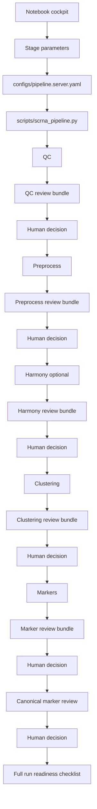

# AI-Assisted scRNA-seq Workflow

Human-in-the-loop, AI-assisted scRNA-seq/snRNA-seq workflow using Scanpy, AnnData, staged notebook orchestration, review bundles, and Codex-assisted biological review.

This project is not a fully autonomous biological analysis system. The user runs each stage, reviews outputs, decides whether to continue or change parameters, and remains responsible for all scientific interpretation.

## What This Project Does

The workflow helps an analyst:

- run a reproducible Scanpy pipeline stage by stage;
- tune parameters at the stage where they matter;
- generate plots, summaries, and review packets;
- ask Codex CLI to review each stage;
- decide whether to continue, rerun, or change parameters;
- prepare safely for a full dataset run after debug review.

## Execution Model

- Codex runs locally on the user's computer.
- Sensitive scRNA-seq data stays on the remote server.
- Full analysis is executed manually by the user on the remote server.
- The local project contains code, notebooks, templates, prompts, and documentation.
- Raw matrices and processed biological data should not be stored or committed locally.
- Codex should not SSH into the server or run analysis unless explicitly instructed by the user.

## Architecture

- `scripts/scrna_pipeline.py`: deterministic Scanpy pipeline engine.
- `scripts/notebook_helpers.py`: notebook orchestration and review helpers.
- `notebooks/01_run_scrna_pipeline.ipynb`: interactive workflow cockpit.
- `configs/pipeline.template.yaml`: local template config.
- `prompts/biology_reviewer.md`: biological review instructions.
- `prompts/review_requests/`: local Codex CLI review bundles.

The notebook writes current parameters to `configs/pipeline.server.yaml` before stage execution. The user then executes pipeline stages in the analysis environment.

## Main Files

- `AGENTS.md`: Codex rules and project safety instructions.
- `PROJECT_CONTEXT.md`: current project architecture and refactor status.
- `NOTEBOOK_USAGE_GUIDE.md`: detailed guide for using the workflow notebook.
- `configs/pipeline.template.yaml`: committed template config.
- `configs/samples.template.csv`: committed example sample sheet for optional `10x_mtx` workflows.
- `env/environment.yml`: conda environment definition.
- `scripts/scrna_pipeline.py`: deterministic pipeline script.
- `scripts/notebook_helpers.py`: notebook helper functions.
- `notebooks/01_run_scrna_pipeline.ipynb`: staged analysis and review notebook.

## Technologies

- Python
- Jupyter
- Scanpy
- AnnData
- harmonypy
- pandas
- numpy
- scipy
- matplotlib
- PyYAML
- Codex-assisted review workflow

## Notebook Workflow

The main workflow lives in:

```text
notebooks/01_run_scrna_pipeline.ipynb
```

Current notebook sections:

1. Initialize Helpers
2. Initial Parameters
3. Write Config
4. QC
5. Preprocess
6. Harmony
7. Clustering
8. Markers
9. Canonical Marker Review
10. Full Run Readiness Checklist

Each major computational stage has nearby stage-specific parameters. The stage run cells use:

```python
nh.run_step_with_current_config(globals(), "<stage>")
```

This writes the current notebook values to `configs/pipeline.server.yaml` immediately before running that stage.

## Pipeline Stages

The deterministic pipeline supports:

1. QC
2. Preprocess
3. Harmony
4. Clustering
5. Markers
6. Plots

The notebook exposes those stages as a controlled human-in-the-loop workflow.

## Review Bundles

After each major stage, the notebook can create a local review bundle in:

```text
prompts/review_requests/<run_folder>_<stage>/
```

Typical files:

- `review_prompt.md`
- `biology_review_packet.md`
- `plots_contact_sheet_<run_folder>_<stage>.png`

The notebook prints a Codex CLI command such as:

```text
Review @prompts/review_requests/<run>_<stage>/review_prompt.md @prompts/review_requests/<run>_<stage>/plots_contact_sheet_<run>_<stage>.png
```

The review bundle is designed for local Codex CLI review after the user syncs the relevant review folder.

Review packets include summaries, selected tables, and plot contact sheets. They intentionally exclude raw expression matrices.

## Contact Sheets

Individual pipeline plots remain in:

```text
results/<run_folder>/figures/
```

Review bundles contain only a compact contact sheet image. This avoids duplicating every plot while still letting Codex inspect stage figures.

## Canonical Marker Review

After marker analysis, the notebook includes a non-computational interpretation checkpoint:

```text
Canonical Marker Review
```

This step:

- uses editable canonical marker panels;
- compares cluster markers against broad brain cell classes;
- asks Codex for tentative broad labels and uncertainty notes;
- does not write labels into AnnData;
- does not assign final cell types automatically.

Default marker panels include broad classes such as oligodendrocytes, OPCs, astrocytes, excitatory neurons, inhibitory neurons, microglia, macrophage/immune cells, endothelial cells, vascular mural cells, fibroblast/VLMC-like cells, and warning programs such as stress or hemoglobin markers.

## Full Run Readiness Checklist

The notebook ends with a non-executing readiness checklist before moving from a debug subset to a full run.

It checks:

- whether debug mode is still enabled;
- whether `configs/pipeline.server.yaml` exists;
- whether review bundles exist for key stages;
- whether the Harmony batch key looks risky;
- which latest run is being checked;
- key final parameters.

This section does not launch the pipeline.

## Input Modes

The current notebook workflow usually writes a server config for an existing AnnData file:

```yaml
input:
  format: h5ad
  path: /path/to/dataset.h5ad
```

Sample sheets are optional and only used for:

```yaml
input:
  format: 10x_mtx
```

`configs/samples.template.csv` is the committed example for multi-sample 10x input.

A real server-specific 10x sample sheet should be named:

```text
configs/samples.server.csv
```

It must remain local and gitignored.

## Server Execution

The full pipeline is intended to run on the remote server manually:

```bash
conda run -n scrna-agent python scripts/scrna_pipeline.py --config configs/pipeline.server.yaml
```

Stage-specific execution is controlled by the notebook helper cells and the pipeline `--step` option.

## Workflow Diagram



## Scientific Guidance

The workflow follows conservative single-cell analysis principles:

- justify QC thresholds;
- avoid overinterpreting debug subsets;
- preserve raw counts in `adata.layers["counts"]`;
- avoid destructive preprocessing;
- treat Harmony as useful but risky;
- never use biological condition or disease outcome variables as Harmony batch keys;
- avoid automatic cell-type assignment;
- separate marker discovery from manual annotation;
- avoid disease interpretation before technical validation and annotation review.

Methodological guidance is informed by established scRNA-seq best practices, including:

- https://www.sc-best-practices.org/
- Heumos et al., Nature Reviews Genetics, 2023

## Safety

Do not commit:

- raw data;
- `results/`;
- `data/`;
- processed `.h5ad` files;
- `.h5`, `.loom`, `.mtx`, FASTQ, BAM, or CRAM files;
- real server sample sheets;
- patient or private sample identifiers;
- private server paths;
- credentials;
- `.env` files;
- logs;
- generated figures and tables.

Do not run full analysis locally.

Do not SSH into the server unless explicitly instructed.

Do not use disease, diagnosis, condition, phenotype, treatment, cognition, outcome, or other biological/clinical variables as Harmony batch keys.

## More Documentation

For detailed notebook usage, read:

```text
NOTEBOOK_USAGE_GUIDE.md
```

For the current development context, read:

```text
PROJECT_CONTEXT.md
```
