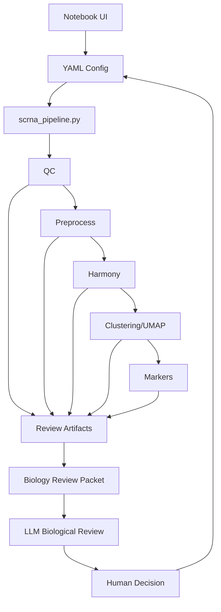

# AI-Assisted scRNA-seq Workflow

Reproducible human-in-the-loop AI-assisted workflow for scRNA-seq/snRNA-seq analysis using Scanpy, AnnData, staged review checkpoints, and LLM-assisted biological review.

## Architecture

- Codex runs locally.
- Sensitive scRNA-seq data stays only on the remote server.
- Full analysis is executed manually on the remote server.
- Local files are templates for code, configs, notebooks, prompts, and workflow helpers.

## Main files

- `AGENTS.md` — rules and instructions for Codex
- `configs/pipeline.template.yaml` — local template config
- `configs/samples.template.csv` — committed example sample sheet for optional `10x_mtx` multi-sample input
- `env/environment.yml` — conda environment
- `scripts/scrna_pipeline.py` — main pipeline script
- `notebooks/01_run_scrna_pipeline.ipynb` — interactive run and review notebook

## Technologies

- Python
- Jupyter
- Scanpy
- AnnData
- harmonypy
- pandas
- numpy
- matplotlib
- YAML configuration
- Codex-assisted review workflow

## Input Modes

The current notebook workflow writes a server config that uses an existing AnnData file:

```yaml
input:
  format: h5ad
  path: /path/to/dataset.h5ad
```

Sample sheets are optional and are only used for `input.format: 10x_mtx`. `configs/samples.template.csv` is the committed example for multi-sample 10x input. A real server-specific 10x sample sheet should be named `configs/samples.server.csv`, kept local, and remain gitignored. `configs/samples.server.csv` is not required for the current `.h5ad` notebook workflow.

## Server execution

```bash
conda run -n scrna-agent python scripts/scrna_pipeline.py --config configs/pipeline.server.yaml
```



## AI-Assisted Workflow

This project is a human-in-the-loop AI-assisted scRNA-seq/snRNA-seq workflow. LLM tools such as Codex are used for code assistance, workflow support, structured biological review prompts, review packet interpretation, and parameter discussion.

Humans remain responsible for running analyses, approving parameter changes, interpreting biological results, and assigning annotations. The workflow is review-driven and is not a fully autonomous biological analysis system.

## Iterative Review Workflow

The workflow is intentionally staged: QC, preprocess, Harmony, clustering, and markers. After each stage, the notebook can generate review artifacts, including tables, plots, summaries, and a biology review packet.

The user can send the generated reviewer prompt and packet to Codex or other LLM tools through CLI or chat interfaces for structured review. The reviewer may suggest parameter adjustments, reruns, Harmony reconsideration, clustering resolution changes, additional QC inspection, or marker interpretation concerns.

The human operator remains responsible for accepting or rejecting suggestions, editing configs, rerunning analysis, and making biological conclusions. The LLM does not directly alter the analysis, and no autonomous execution loop exists; the workflow is review-driven and human-supervised.

## Scientific Guidance

The workflow structure and review prompts are informed by established single-cell analysis best practices and conservative interpretation guidelines, including guidance from https://www.sc-best-practices.org/.

Review focuses on QC filtering, batch correction, clustering resolution, marker interpretation, and annotation uncertainty. The project supports reproducible and reviewable analysis, not automated biological decision-making.

## Safety

Do not commit:

- raw data
- results/
- data/
- processed `.h5ad`
- real server sample sheets
- private paths
- `.env`
- logs
- generated figures and tables
